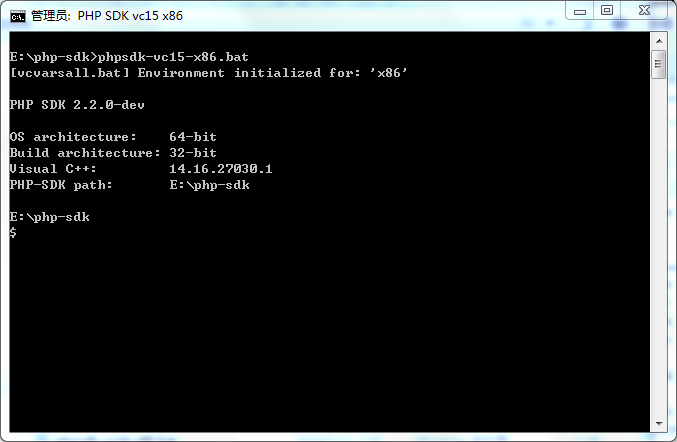
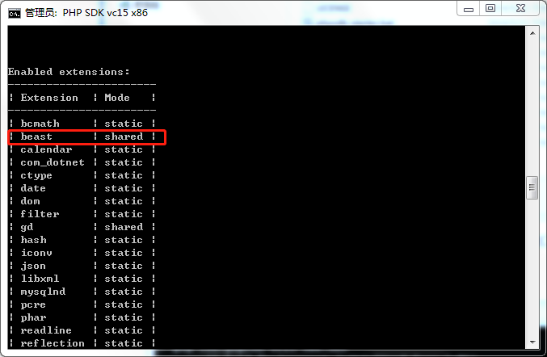
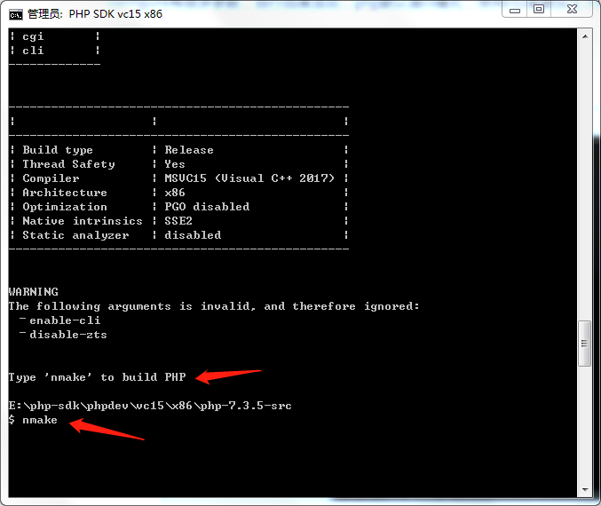
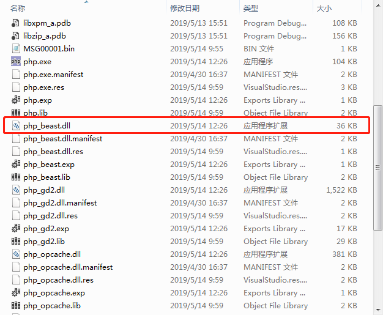

**php-beast** windows版本自行编译指南


**php-beast**版权归原作者


**php-beast**这个工具还是挺好用的，可惜作者具体指导用户进行windows版编译，其他人提供编译好的自己只能用资源编辑工具修改默认密码，不方便，我不是程序员，只是有些兴趣，经多次百度，总算自行编译出来了，md文件也是第一次写，凑合看吧。

我自己电脑上的PHP版本是php-7.3.5-NTS-Win32-VC15-x86的，本次教程目标是为这个版本编译php-beast

1、资源准备

a）下载**php-beast**  

下载地址：https://github.com/liexusong/php-beast

b）下载**php-sdk-binary-tools**   

下载地址：https://github.com/microsoft/php-sdk-binary-tools

c）下载PHP7.35

https://windows.php.net/downloads/releases/php-7.3.5-src.zip

c）下载并安装编译环境

PHP7是用VC15编译的，没有VC15，所以到微软的官网上下载visual
studio 2017 entrpise的试用版即可（根据PHP版本的编译环境选择安装扩展编译VC版本）。
地址：
<https://www.visualstudio.com/zh-hans/?rr=https%3A%2F%2Fwww.microsoft.com%2Fzh-cn%2F>

2、目录准备及编译

编译前请确认是否安装好vs2017

a）新建一个编译目录，我自己准备的是E盘根目录下解压**php-sdk-binary-tools**   并重命名为php-sdk，测试编译工作目录为E:\php-sdk，截图如下：


b)在当前目录E:\php-sdk下按住shift键同时右击鼠标，选择“在此处打开命令窗口”打开命令行，phpsdk-vc15-x86.bat脚本



c)再运行：phpsdk_buildtree phpdev，等待结束
```
E:\php-sdk
$ phpsdk_buildtree phpdev
```
结束后会在E:\php-sdk\下生成“phpdev\vc15\x86”目录结构，解压php-7.3.5-src.zip，把php-7.3.5-src放到X86目录下，同时在x86下手动创建“prcl”目录，解压php-beast-master.zip，复制php-beast-master到prcl目录下，并改名为beast。

d)在命令行下运行“cd phpdev\vc15\x86\php-7.3.5-src” 进入“E:\php-sdk\phpdev\vc15\x86\php-7.3.5-src” ,执行“phpsdk_deps --update --branch master”命令用来获取SDK的依赖包，最终目录结果如下图：


```
E:\php-sdk\phpdev\vc15\x86\php-7.3.5-src
$ phpsdk_deps --update --branch master
```

等待下载结束后返回到命令模式。

e)修改代码。进入“E:\php-sdk\phpdev\vc15\x86\pecl\beast”目录修改php-beast代码

（1）添加“win95nt.h”文件utf-8编码，内容如下（这个文件在“beast_log.h”中引用了，Linux下用于的是“unistd.h”，win95nt.h编译时提示找不到这个文件，度娘说的，直接新建一个，加入下面的内容引用替换）

```c
#include <io.h>
#include <process.h>
```

（2）修改beast_log.h代码，这个好像是修改unix/Linux系统下文件属性的，win下不需要，不修改的话无法编译

```c
int beast_log_chown(uid_t uid, gid_t gid);
```

修改为：

```c
#ifdef PHP_WIN32

#else
int beast_log_chown(uid_t uid, gid_t gid);
#endif
```

修改至此编译可以通过，但是会提示一些警告信息，可以不管也可以自己自行修改吧

我自己的修改如下beast_mm.c第126行

```c
else if (cur->size > (int)(sizeof(beast_block_t) + realsize)//此处修改添加(int)
```

其他还有好几处，都忘记了。

编译的目的就是为了编译处属于自己修改了密码的dll文件，所以原作者说要大家修改的地方如下：

> ## 制定自己的php-beast
>
> `php-beast` 有多个地方可以定制的，以下一一列出：
>
> *1.* 使用 `header.c` 文件可以修改 `php-beast` 加密后的文件头结构，这样网上的解密软件就不能认识我们的加密文件，就不能进行解密，增加加密的安全性。
>
> *2.* `php-beast` 提供只能在指定的机器上运行的功能。要使用此功能可以在 `networkcards.c` 文件添加能够运行机器的网卡号，例如：
>
> ```c
> char *allow_networkcards[] = {
> 	"fa:16:3e:08:88:01",
>     NULL,
> };
> ```
>
> 这样设置之后，`php-beast` 扩展就只能在 `fa:16:3e:08:88:01` 这台机器上运行。另外要注意的是，由于有些机器网卡名可能不一样，所以如果你的网卡名不是 `eth0` 的话，可以在 `php.ini` 中添加配置项： `beast.networkcard = "xxx"` 其中 `xxx` 就是你的网卡名，也可以配置多张网卡，如：`beast.networkcard = "eth0,eth1,eth2"`。
>
> *3.* 使用 `php-beast` 时最好不要使用默认的加密key，因为扩展是开源的，如果使用默认加密key的话，很容易被人发现。所以最好编译的时候修改加密的key，`aes模块` 可以在 `aes_algo_handler.c` 文件修改，而 `des模块` 可以在 `des_algo_handler.c` 文件修改。
>
> ------
>
> ## 

经过上面代码准备和代码修改，就可以执行编译了，三步走：

执行buildconf命令，并等待结束

```
E:\php-sdk\phpdev\vc15\x86\php-7.3.5-src
$ buildconf
```

执行configure命令并等待结束

```
E:\php-sdk\phpdev\vc15\x86\php-7.3.5-src
$ configure
```

configure有很多参数，自行百度添加，php默认是ts模式，使用nts需要加上下面参数

```
E:\php-sdk\phpdev\vc15\x86\php-7.3.5-src
$ configure –enable-cli –disable-zts
```

执行后如下图



红框中就是beast模块，说明之前做的都正确了。

这面configure时我没有关闭其他模块，而是默认全开了，如果你电脑配置不高的话建议关闭不必要的模块，毕竟我们只是要编译php-beast这一个扩展，扩展编译全开的话最后编译时很耗时间，我的电脑配置可能高一些，几分钟就好了，结束后如下图



最后一步执行nmake命令

```
E:\php-sdk\phpdev\vc15\x86\php-7.3.5-src
$ nmake
```


编译成功



至此，属于自己修改过密码等定制的windows版的dll文件编译完毕。

注意事项：

1、目录结构要正确

2、版本要对应，自己用的PHP的版本是多少，X86还是X64，ts还是nts，运行库是VC哪个版本。
